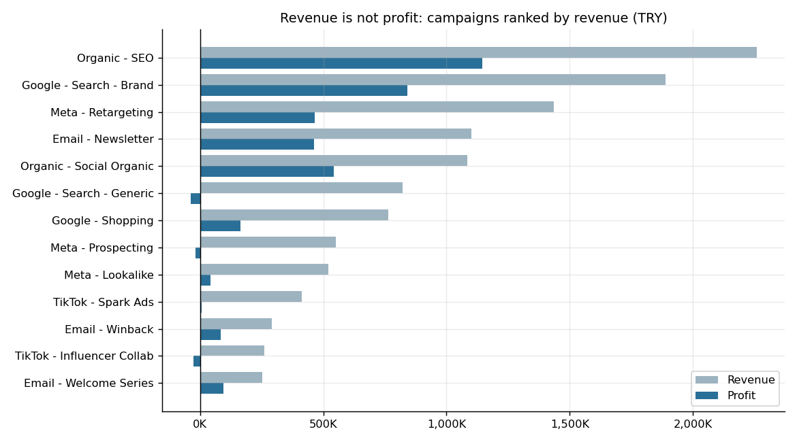
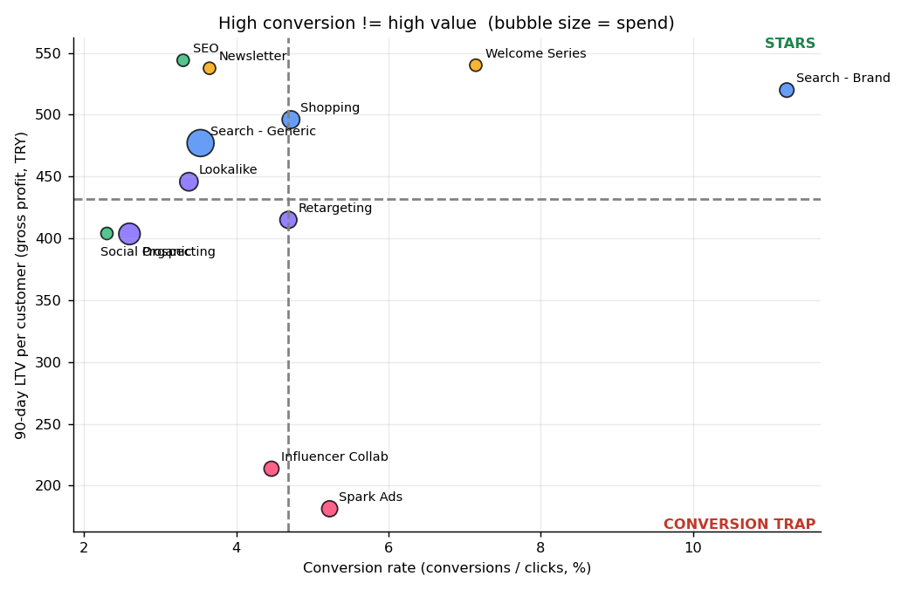

# 📣 Marketing Campaign Intelligence

**English** · [Türkçe](README.tr.md)

Which marketing campaigns create *profitable, repeat* customers, not just clicks and revenue? This project computes CAC, ROAS, profit and LTV across 5 channels and 13 campaigns, then visualizes the results in a Streamlit dashboard and a Power BI model.

**Stack:** Python (pandas) · SQL (SQLite) · Streamlit · Plotly · Power BI

> **The data is synthetic.** Per-channel spend with customer-level revenue is not publicly available, so the data comes from a seeded simulator ([`src/generate_data.py`](src/generate_data.py)). Channel behaviours are assumptions written in code. The value of this repo is the **method and pipeline**, not the exact numbers.

## Dashboard


## Key findings (FY2025, TRY)

Portfolio: **1.82M spend → 11.64M revenue → 3.76M profit**, paid ROAS 4.57x, paid CAC 224 TRY.

1. **Revenue ≠ profit.** Google *Search – Generic* is #6 by revenue but last by profit (−38K TRY).
2. **Conversion trap.** TikTok *Spark Ads* converts at 5.2% (average 4.7%), but its customers are worth 181 TRY in 90 days vs a 432 TRY average (19% repeat rate, 19% returns). TikTok as a whole loses money despite a 2.3x ROAS.
3. **Segments.** 35–44 Fashion buyers are the best segment on Email, Google and Meta. 18–24 Cosmetics loses money on Meta.
4. **Budget shift.** Moving 30% of spend from low LTV:CAC campaigns only pays off if the extra spend converts at ≳59% of its historical efficiency, so test before scaling.




Full report: [`reports/findings.md`](reports/findings.md)

## How it works

- **Data:** `campaigns_daily` (date × campaign), `customers`, `orders` (last-click attributed).
- **Metrics:** CTR, CPC, CPL, CPA, conversion rate, CAC, ROAS, profit, LTV (90/180 days), LTV:CAC.
- **Key choices:** CPA uses all attributed orders, CAC uses new customers only · LTV counts only customers observed for the full window (no fake zeros) · headline ROAS/CAC are paid-only, organic has no media cost.
- **SQL:** 4 queries in `sql/` (CTEs, window functions) · **Power BI:** star schema in `powerbi/data/`, DAX in [`docs/powerbi_guide.md`](docs/powerbi_guide.md).

## Run it

```bash
pip install -r requirements.txt
make all          # data → analysis → figures
make dashboard    # open the Streamlit app
make test         # 8 tests
```
Without `make`: `python -m src.generate_data && python -m src.marts && python -m src.analysis`

